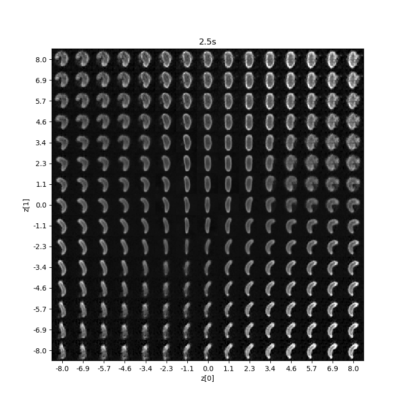

thisWormDNE
========

This Worm Does Not Exist (DNE) is a module to generate completely synthesized videos of
An example is shown below.

We start with our video of interest. Here we see a set of videos of the stimulus response in a planarian flatworm

It achieves this by first stacking adjacent frames of video to form  clips of dimension
(height, width, channels, time points).  A Variational Autoencoder (VAE) is trained to
find a generative latent embedding of these clips in a low dimensional space (See VAE_video.ipynb).
To work best, there should be some motif patterns contained in your video
(eg. the set of a worm's motions, the rhythm in a dancer's movement).
At this point, we can sample the latent space through the VAE decoder to see the embedding.  
Note that for this video, the frames are both rotated and resized proportionally
to the long axis of the worm to reduce variances we don't want captured by the VAE.

We can now train a generative model on the dynamics seen within the embedded video.
Here we use a rSLDS model from (https://github.com/slinderman/ssm) since it can both
be stochastically sampled and be supplied time-dependent inputs (e.g stimulus state, see latentModel.ipynb).
In principle, any model  meeting these criteria will do.

Once fit, the model can then be sampled in response to arbitrary inputs.
Each point in the sampled trajectory is then transformed into video using the same VAE decoder network.
Here we show an entirely simulated set of worm behaviors, with the generated latent dynamics to the rights and
images on the left.

Feel free to play with your own videos.  If you make something cool, please share!

## Authors

* **Samuel Bray**

## License

This project is licensed under GNUV3
